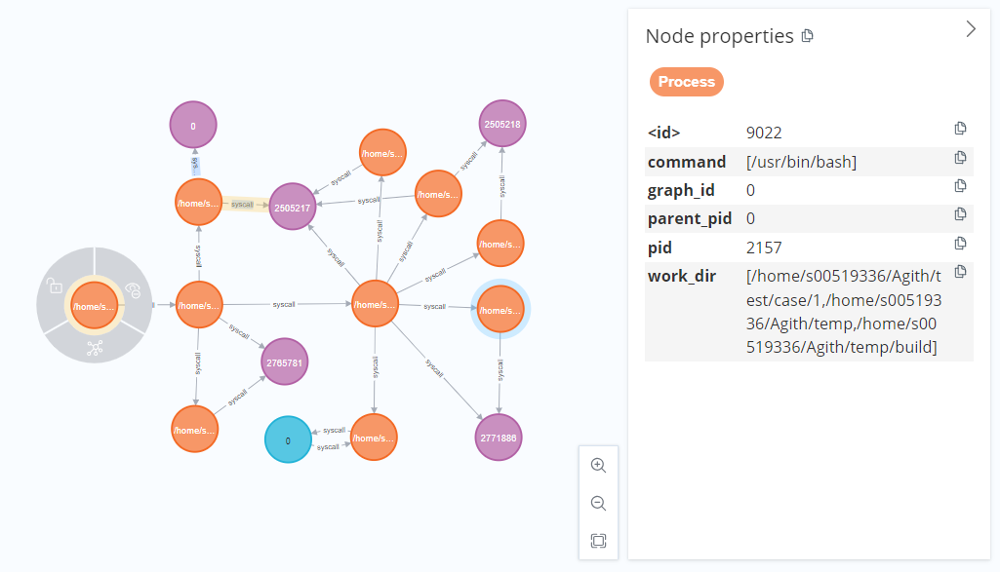
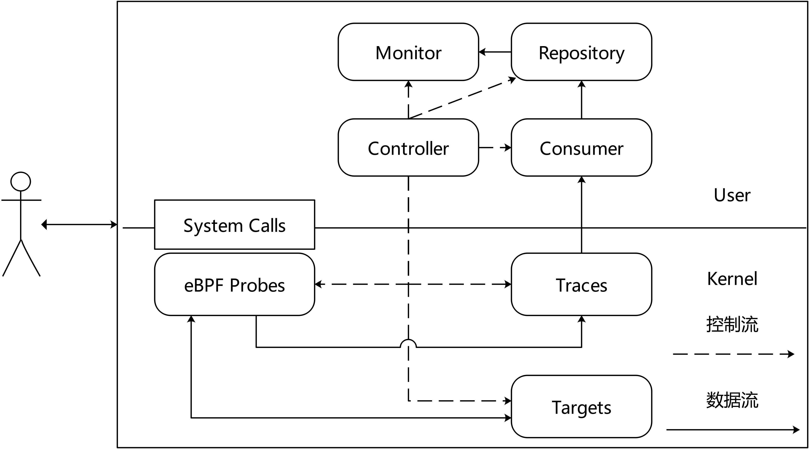
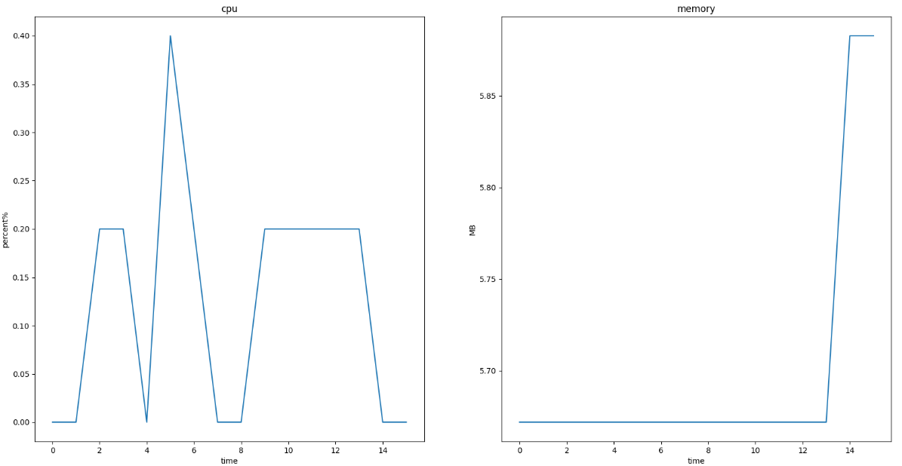
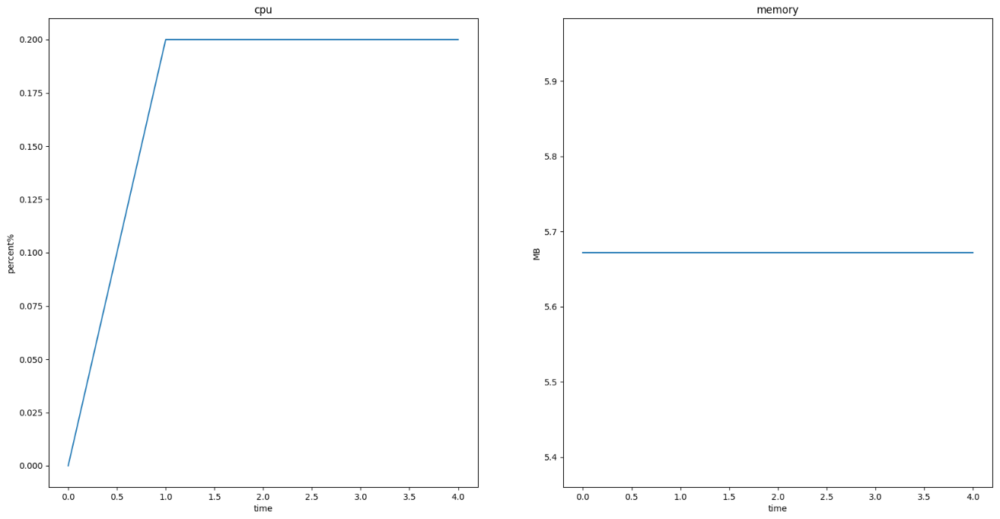
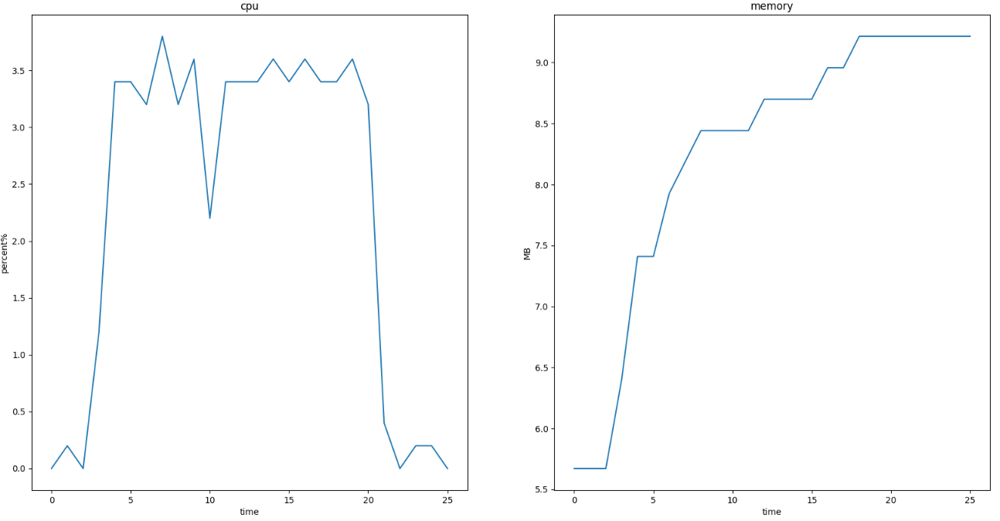
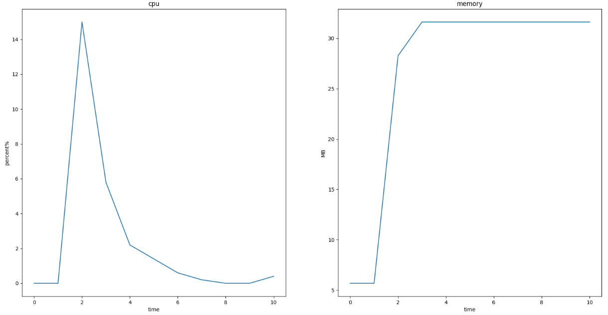
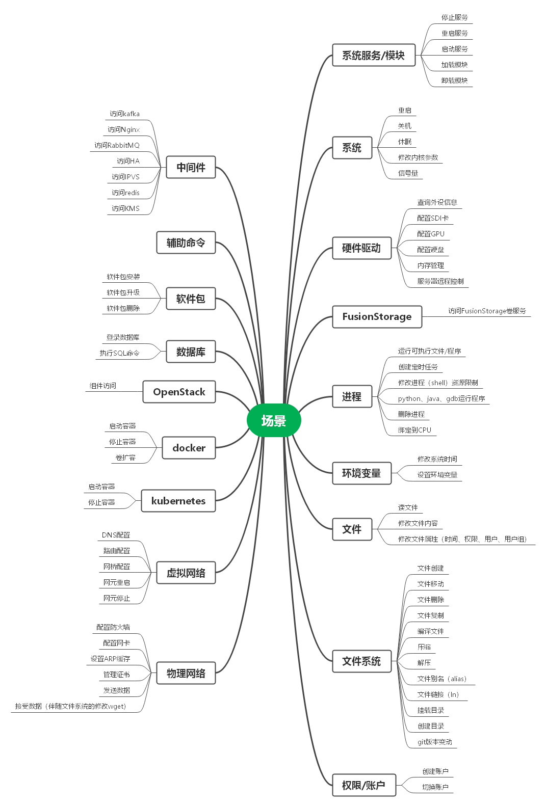

# Agith

**此开源项目非华为产品，仅提供有限支持**

Agith 是一款变更监控工具。IT 运维过程中会执行大量的变更操作。这些操作会给系统引入风险。为了构建确定性运维能力，需要监控变更过程，并输出变更影响面。变更影响面是指变更过程访问的文件、网络节点、用户服务、数据库表等构成的集合。

## 1. 研究背景

运维中变更操作是 IT 系统故障的一大诱因。根据公开论文分析，云厂商公开故障案例的归因分析中，84.7%的故障发生在系统升级与维护的过程中。变更故障有时会严重影响公众生活。例如 2023 年 1 月份，美联航管理系统故障引发全美航班延误。最终的事件调查指出是运维过程中运维人员错误删除了系统文件导致故障。

在 DevOps 理念中，开发过程应该有运维人员的参与，开发人员也应该参与运维工作。这种新模式使得产品开发不仅只考虑业务需求，也要考虑运维场景。同时面向产品的运维工具也越来越多。当前主流的运维数据，包括 metrics/log/trace，都有众多的运维工具。与变更操作相关的运维工具也有，但缺乏直接有效的运维数据。

## 2. 相关工作

变更监控的现有方案和产品有很多。例如 AWS 的[CloudTrail](https://docs.aws.amazon.com/awscloudtrail/latest/userguide/cloudtrail-user-guide.html)，阿里云的[ActionTrail](https://help.aliyun.com/product/28802.html?spm=a2c4g.28830.0.0.60ae5162hdYeH9)，华为云的[CTS 服务](https://www.huaweicloud.com/product/cts.html)。这类服务的数据源是用户与云管理系统的交互的操作日志，例如虚拟机的申请、变更、删除、扩缩容等操作。但是不涉及用户在虚拟机中的各项操作。

当前常用的变更监控方法是命令日志——将变更过程中运维人员输入的所有命令记录下来。但是变更命令不能表征运维人员的操作意图。很多命令是通过通过脚本与可执行文件来完成，从脚本名或者程序名上是无法了解程序的操作过程。这导致之后安全审计与故障根因定位非常依赖专家经验，效率低，分析困难。

另一种方式是将命令拆解为系统调用，例如采用`strace -f`记录每条命令的系统调用，从中可以了解进程的行为。但是这样做的数据量是非常庞大的。仅仅一条命令`ls -al`就会有 280 条系统调用。而且系统调用解读困难，难以在安全审计与根因定位中发挥作用。

## 3. 变更影响面

本项目尝试创建一种新的运维数据——变更影响面。一开始想命名为变更日志，但是这种数据是以图的方式存储，与日志差别很大。变更影响面更能体现这种数据采集的格式与目的。首先用一个简单的例子说明这种数据的形式。假设在运维过程中登录一台服务器/虚拟机，执行一个脚本文件“main.sh"，执行完成之后退出。最终采集得到如下的拓扑图。



图中黄色节点表示进程，紫色节点表示文件，蓝色节点表示。其中 id 为 0 的进程节点是初始监控目标，即运维人员登录的 bash 程序。通过进程节点的关联关系，可以看到 main.sh 在执行过程中调用了`dirname`, `python test.py`, `sh script.sh`命令。然后 script.sh 脚本有调用了`touch`, `sed`, `rm`, `curl`等命令。通过紫色的文件节点，可以看到不同的命令操作过哪些文件。例如`python test.py`操作了文件`test.txt`。蓝色节点则展示命令执行过程中与哪些远程节点通信。例如`curl`访问了域名`www.baidu.com`, 远程节点的 IP 地址是“127.0.0.1”（该节点部署了代理），端口号是 14348。

以上是一个变更影响面的样例。它与日志非常相似。普通日志是记录应用程序运行中的各项行为，变更影响面则记录了运维人员在变更执行过程中的各种行为。但是变更影响面选择用图来存储。这样可以方便展示运维中各种要素之间的相关关系。

变更影响面是[相关工作](#相关工作)中命令日志与系统调用方案的折中。命令日志缺失重要信息，系统调用方案冗余信息太多。这两种方式都无法直观展示运维操作对系统产生的影响。变更影响面只保留对系统产生影响的行为，同时采用图结构展示这种关联关系。

## 4. 系统架构



系统架构分为 5 个模块：

1. Controller：控制模块，负责管理其他各个模块的声明周期。
2. eBPF 模块：包含 eBPF Probes、Traces、Targets 三个部分。
3. Consumer：负责从 Traces 中读取数据
4. Repository：负责处理 Consumer 读取的数据。将 trace 记录整理为影响面的图结构数据。
5. Monitor：告警模块，负责检查 Repository 图中是否包含危险行为。

Agith 在设计中采用数据流与控制流分离的策略。eBPF 模块，Consumer，Repository 和 Monitor 模块可以组成数据采集、整理、输出的数据流（图中实现）。控制流则以 Controller 模块为核心，其他模块受 Controller 模块的统一管理（图中虚线）。启动时 Controller 模块检测环境，分析配置文件，检查启动参数。然后依次启动部署各个模块。当程序结束时管理各个模块完成清理任务后依次退出。

控制流采用星状结构，数据流采用链式结构。数据流的起点是 eBPF 模块。变更影响面的采集方法是一种基于 eBPF 的动态目标的变更监控技术。eBPF 建立在原有的 linux trace 技术之上。可以通过 Tracepoint、Kprobe 机制在内核中插入探针，获取内核运行中的数据。同时提供了 Map 机制，方便内核态与用户态的数据交互。Agith 首先建立了两类 map。第一类是 target map。这一类 map 保存了需要监控的目标的标识符。例如对于需要监控的进程，使用进程的 tgid 作为标识符。第二类是 trace map。这一类 map 用于存储探针获取的数据。然后对于需要监控的系统行为，选择特定的系统调用编写探针程序（eBPF Probe）并应用 eBPF 挂载在系统调用上。这些程序被触发时，首先根据 Target 判断系统调用是否与监控目标相关。如果不相关直接返回。如果相关会收集数据写入 Trace，并修改 target。例如对于 clone 系统调用，在 sys_exit_clone 处挂载探针程序。当任何程序执行 clone 系统调用，sys_exit_clone 被触发。探针程序检测进程 tgid 是否在 target map 中。如果不存在就正常返回。如果存在，会将返回值即子程序的 pid 写入 trace，然后将子程序的 pid 添加到 target map 中。这样子程序也被纳入监控范围内了。

动态目标机制从大量的系统调用数据中筛选出与变更操作相关的数据，这些数据存储在内核态的 Trace 类 Map 上。Consumer 模块的功能是将 Trace 类 Map 上的数据初步整理到用户态。这个过程设计到读写速率控制，数据异常处理，数据融合等。

Consumer 读取的数据类似 strace 得到系统调用记录，但是采用“主谓宾”的结构体管理。

```
pid:411962, syscall:read, ret: 18, time:974333207983984, ready:1, obj:{fd:3, i_ino:2505217}
```

这是一条监控 read 系统调用得到的记录。“主语”是`pid:411962`，表示一个进程号为 411962 的进程。“谓语”是`syscall:read`，表示读取操作。“宾语”是`obj:{fd:3, i_ino:2505217}`表示是一个文件，文件句柄号是 3，inode 编码是 2505217。除此之外还有这次系统调用的时间和返回值。这条记录的含义是进程 411962 读取了文件 2505217。这条信息非常简陋。进程执行的程序名是什么？读取的文件名是什么？这些信息包含在之前的记录中。例如进程名包含在在 exec 系统调用中， 文件名包含在 openat 系统调用中。

将这些信息整合成图结构就是 Repository 模块的功能。Repository 依次读取 Consumer 输出的记录，将信息填充到图中去。例如打开一个新文件，会创建一个文件节点，并在进程与文件之间连接一条边。除此之外 Repository 负责数据的输出，以及向 Monitor 模块传递信息。

Monitor 模块负责告警。如果在采集数据的过程中发现高危操作，例如删除重要的配置文件，Monitor 模块会发送告警。Monitor 的数据来源于 Repository。因为只有 Repository 存储的图中才能掌握完整的上下文信息。仅仅依靠 Consumer 的记录不足以判定是否是高危操作。

## 5. 文件结构

| 目录名      | 含义               |
| ----------- | ------------------ |
| config      | 配置文件           |
| doc         | 说明文档与图片资料 |
| include     | 头文件             |
| src         | 源代码             |
| test        | 测试程序           |
| tool        | 一些脚本工具       |
| License.txt | 木兰证书           |
| README.md   | readme 文件        |

为方便阅读代码，此处对 src 目录中的文件进一步说明。首先是 model 文件夹。这个文件夹的文件，除了 BPFLoader 之外，其他文件与系统架构中的模块是一一对应的。可以参考[系统架构](#4-系统架构)来理解程序功能。BPFLoader 是 BPF 探针加载模块。动态目标机制需要多个文件中的多个探针程序共享多个 map。所以使用[linux 内核文件](https://github.com/torvalds/linux/tree/master/samples/bpf)中的加载模式，或者[bpf demo](https://github.com/libbpf/libbpf-bootstrap)不合适。这些 eBPF 程序的加载方式更适合将所有探针程序写在同一个文件里。当探针程序太多，管理就会混乱。所以根据 linux 内核 eBPF 加载程序编写了 BPFLoader，支持读取一个文件夹下所有编译文件后再链接加载。

BPF 文件夹对应[系统架构](#4-系统架构)的 eBPF 模块。各个文件的含义如下：
|文件名|含义|
|---|---|
|file.c|与文件相关的探针程序|
|map.c|只包含 maps.h 头文件，目的是让 make 生成 map.o|
|maps.h|所有 map 的定义|
|process.c|与进程相关的探针程序|
|socket.c|与网络相关的探针程序|
|syscall_args.h|系统调用的参数，参考/sys/kernel/debug/tracing/events/syscalls 中各个系统调用的 format 文件|
|utils.h|通用函数，例如申请 trace 空间，默认返回函数，删除监控目标等操作|
|vmlinux.h|集成内核头文件，与内核版本相关。代码仓不提供该文件，在编译过程中由命令生成。|

graph 是 repository 绘制图过程中需要的类。图包含两个要素 Edge（边）与 Node（节点）。其中 Node 是一个抽象类。根据不同的节点类型，派生了 FileNode、PipeNode、ProcessNode、SocketNode，分别表示文件节点、管道节点、进程节点、网络节点。

tool 是程序主业务之外的功能类。
|文件名|含义|
|---|---|
|Log.cpp|日志类，本文采用 log4cplus 日志框架|
|Manual.cpp|将编码翻译为文字，例如 read 系统调用的编码为 0|
|utils.cpp|一些通用函数|

## 6. 安装与使用指导

Agith 可以通过 rpm 安装到 bin 目录，也可以通过源码自行编译安装。Agith 运行编译依赖如下。

**6.1 操作系统**：

推荐使用 openEuler 20.03 版本（内核版本 4.18~19）。其他 linux 发行版未经测试。openEuler 更高版本，例如 22 版以上，由于内核版本高于 4.18，会导致内核数据结构不适配。这个问题会在下一个版本修复。

**6.2 Agith 运行依赖库**：

| 依赖库名称 | 版本  |
| ---------- | ----- |
| elfutils   | 0.180 |
| jsoncpp    | 1.9.3 |
| log4cplus  | 2.0.5 |
| libbpf     | 0.1.1 |

**6.3 Agith 编译依赖库**：

| 依赖库名称      | 版本   |
| --------------- | ------ |
| cmake           | 3.16.5 |
| make            | 4.3    |
| clang           | 10.0.1 |
| llvm            | 10.0.1 |
| elfutils-devel  | 0.180  |
| jsoncpp-devel   | 1.9.3  |
| log4cplus-devel | 2.0.5  |
| libbpf-devel    | 0.1.1  |
| gtest-devel     | 1.8.1  |

除以上配置外，其他版本未测试，欢迎补充。

**6.4 Agith 启动参数**：
|启动参数|含义|
|---|---|
|-p|初始目标进程的 PID|
|-c|配置文件路径，默认路径/etc/Agith.conf|
|-q|停止 Agith|

**6.5 Agith 编译方法**

在 Agith 项目第一层目录下执行：

```
./build.sh compile
```

## 7. 配置文件说明

## 8. 性能测试

**测试环境**：一台规格为 2U4G-si3.large.2-hcd 的虚拟机，操作系统为 OpenEuler20.03_64bit_en_basic_dec，内核版本 4.19.

**测试命令**：与进程、文件、网络相关的命令，例如`vim, rm, touch, sed, awk, cat, echo >, curl`等。

**测试指标**：

1. Trace 数目。在一轮测试中 Consumer 读取的 trace 数目。
2. CPU 利用率。此处的 CPU 利用率是单核利用率。
3. 内存用量。
4. 生成文件大小。

**测试场景**：

1. 手动变更。手动输入如下命令执行变更。
2. 自动变更。通过脚本执行变更。
3. 极限场景。通过脚本执行 5000 条文件操作与网络访问命令，平均 58 条/秒
4. 异常场景。在极限场景基础上删除硬盘 IO 与网络访问相关的命令。这样可以提高命令执行速率到 1667 条/秒。

**测试结果**：

1. 手动变更

| Trace | CPU  | MEM  | File |
| ----- | ---- | ---- | ---- |
| 747   | 0.4% | 5.8M | 95kb |



2. 自动变更

| Trace | CPU  | MEM  | File |
| ----- | ---- | ---- | ---- |
| 306   | 0.2% | 5.6M | 50kb |



3. 极限场景

| Trace  | CPU  | MEM  | File  |
| ------ | ---- | ---- | ----- |
| 126544 | 3.8% | 9.2M | 21.2M |



4. 异常场景

| Trace | CPU | MEM | File |
| ----- | --- | --- | ---- |
| 46906 | 15% | 31M | 7.6M |



在异常场景中，由于命令执行速率过快，触发了 CPU 利用率上限（5%）。Agith 清除了监控目标，测试命令的后续行为不再记录。所以 CPU 利用率快速下降。

## 9. 开发计划

接下来的开发计划有两个。第一个是拓展影响面的范围。当前变更影响面只包含文件、进程、网络。之后要覆盖如下场景。



第二点是优化软件。例如适配内核 4.19 以上的版本。这需要修改 BPF 程序的加载模式，部分探针程序代码。

## 10. 开源许可协议

本项目采用[第 2 版木兰宽松许可证](License.txt)
